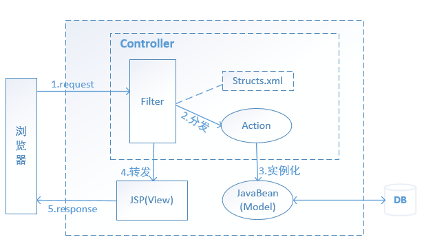

### 前言
##### 2020/5/29记： 
最近因为各种原因懈怠了不少，强烈的不安让我准备开始新的学习。在这之前已经把java的基础倒是掌握了不少了，像反射和动态代理的东西基本上都搞清楚了。
本来想继续沿着weblogic继续学，但是感觉前面的java框架、中间件的知识点缺少的太多了，像weblogic这样大型的中间件直接想去分析漏洞对我来说还是很困难。  
所以还是选择了一个古老的java框架来学习他的漏洞，从而开始全面的java的学习。
### Struts2
#### 定义
Struts2是一个基于MVC设计模式的Web应用框架，他本质上相当于一个servlet,在MVC设计模式中，Struts2作为控制器来建立模型与视图的数据交互。   
下图展示了Struts2的工作原理：  
 
#### 漏洞复现
struts2的漏洞发现了50多个，找了个维基的列表：https://cwiki.apache.org/confluence/display/WW/Security+Bulletins
这上面显示了58个漏洞，以及漏洞简介，
准备尝试去将这58个漏洞复现一下。   
因为时间原因，还有就是struts2框架现在还是用的渐渐少了，所以主要做了解用。58个漏洞中主要先去复现前10个漏洞，复现过程中，能够跟着漏洞，深入代码学习。做到心中大致有数。s2-10复现完之后，后面还剩下48个漏洞就不一个一个的去看了，就去看看以下漏洞：
###### s2-016
###### s2-020
###### s2-037
###### s2-045
###### s2-046
###### s2-057

#### 漏洞环境搭建
各个漏洞的版本不同，这里只记录其中一个版本的环境搭建，其他大同小异不再记录。
以struts版本2.1.6为例： 
- 下载/struts/2.1.6，地址为：http://archive.apache.org/dist/struts/binaries/struts-2.1.6-apps.zip
- 搭建Tomcat环境，这里选择一个xampp工具集成了Tomcat，Apache等环境
- 将struts2-showcase-2.1.6.war复制到xampp里Tomcat下的webapps里
- 访问http://127.0.0.1:8080/struts2-showcase-2.1.6/showcase.action

到此环境搭建完成，只需要去复现分析漏洞即可。

##### 漏洞复现目标
1. 了解java框架，在了解大致的struts的框架之后，在去学习了解spring之类的。
2. 补足java的基本知识点，现在除开最基础的内容了解了以外还有挺多东西遇到了也需要去学习了解
3. 了解java的web应用程序常出现的漏洞种类，触发漏洞的原因，怎么触发漏洞等

### Deadline
不规定个时间，可能磨蹭磨蹭这就没了。鉴于6月整个月的时间学校的事情可能会很多，很多考试接踵而来，可能没有太多时间能给我去自己学习这些玩意儿，
所以给自己规定7月底之前能做好吧ヾ(◍°∇°◍)ﾉﾞ。
