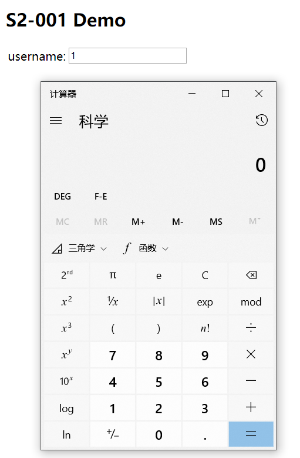
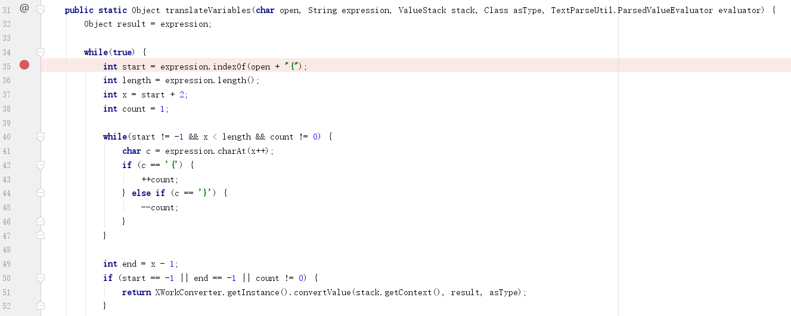
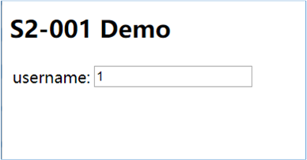

### 前置知识
#### ognl表达式
OGNL的全称是Object Graph Navigation Language(对象图导航语言)，它是一种强大的表达式语言，让你通过简单一致的表达式语法来读取和设置Java对象的属性值，调用对象的方法，遍历整个对象的结构图，实现字段类型转换等功能。　
%符号的用途是在标志的属性为字符串类型时，计算ognl表达式的值。也通过%{}来表示花括号内容内为ognl表达式。  
ognl表达式以及表达式注入还挺多内容的。后面再详细看看吧，现在还有点搞不懂。( ๑ŏ ﹏ ŏ๑ )


### 漏洞复现
在Struts 2 框架的表单验证机制（ Validation ）中存在漏洞，会执行Ongl表达式。    
随意在框架中寻找一个表单，然后内容填写Ongl表达式如：%{1+2}，表单会执行这个表达式，返回3。   
  
可以通过ognl表达式执行任意命令，例如弹出计算器：    

```
%{ #a=(new java.lang.ProcessBuilder(new java.lang.String[]{"calc"})).redirectErrorStream(true).start(), #b=#a.getInputStream(), #c=new java.io.InputStreamReader(#b), #d=new java.io.BufferedReader(#c), #e=new char[50000], #d.read(#e), #f=#context.get("com.opensymphony.xwork2.dispatcher.HttpServletResponse"), #f.getWriter().println(new java.lang.String(#e)), #f.getWriter().flush(),#f.getWriter().close() }
```
  
### 漏洞分析
#### 影响版本
Struts 2.0.0 - Struts 2.0.8
#### 漏洞成因
Struts 2 框架的表单验证机制（ Validation ）主要依赖于两个拦截器：validation 和 workflow。  
validation会根据XML配置文件来创建一个验证错误列表；workflow根据上述创建的验证错误列表来检查当前所提交的表单是否存在验证错误。    
当workflow 拦截器检测到用户所提交的表单存在任何一个验证错误，workflow 拦截器都会将用户的输入进行解析处理，随即返回并显示处理结果。  
而structs2框架中，当验证出错时，往往会保留在现有界面，并原样返回用户输入的值。    
同时structs2框架的XWork组件中含有一个对标签处理的功能—— altSyntax，主要作用在于支持对标签中的OGNL表达式进行解析并执行。 
综上，当攻击者恶意构造ognl表达式在表单验证机制处，workflow的检测机制会导致ognl被解析执行，并在原页面输出执行结果。

#### 漏洞修复
改变了ognl表达式的解析方法从而不会产生递归解析，用户的输入也不会再被解析执行。

### 代码跟进
#### IDEA搭建
搭建过程一言难尽，在搭建过程中遇到许多问题。具体的话看参考文件里面第一个链接。下面记录一下我的搭建和犯错过程：  
1. 首先，去下载了别人已经写好的代码，含表单登录验证的页面。  
2. 然后直接将整个包用IDEA打开，打开之后我就想直接执行，发现需要配置Configurtions，就按照Tomcat配置走就行。   
3. 然后就各种报错。总结一下正确的流程应该是去project structure里面配置Facets和Artifacets。在Facets中注意配置web.xml的位置要选好，不要选错了，不然又会一堆错误。  
4. 做完上述的步骤还是有报错，我的web.xml里面的java类是显示红色，应该是包没有包括进来，所以还是在project structure里面的Libraries，要去将所有的包包括进来，一般第一步选对的话就没有什么问题，要是第一步没选对，后面改又会有很多问题，所以要是安装上面的步骤配置好了但是运行还是出错了，就另外重新来一次。（我就是第一次在第一个环境内出了各种错，环境已经被搭乱了，在重新选择打开IDEA重新按照正确的步骤走一次，一次就成功了╮( •́ω•̀ )╭）。

#### 分析流程
先输入表单内容username：1 以及 password：%{1+2} 若要通过表单的验证username为admin，password为password。不过根据前面的了解，这里肯定是需要验证不通过。  
首先跟进到最外面我们写的代码，对表单验证的代码。    
      
调试到最后return ERROR，之后就进入了jar里面的类中。  
  
（DefaultActionIncation.class），正如之前了解到的那样，在s2框架中的验证程序，若验证正确会根据用户写的代码进行操作，而若验证错误会保持在原页面，以及原样显示用户输入（正常情况下）。
前面的步骤就是在判断验证到底是正确还是错误。在红框这里进入成功或是失败后的操作。  
   
这里就是判断如果验证通过会到哪个界面，而如果是验证错误就是留在当前页面。  
之后就是显示页面的操作了，而漏洞正是在这一步产生的。此时的传递出去的username：1 而password仍然为%{1+2}，表达式还未被解析。    

直接来到解析的代码（Xwork.jar-util-TextParseUtil.class）对可能存在的标签进行解析，通过UIBean.class对当前页面即index.jsp的s标签进行解析（通过调试与其说是对index.jsp里的标签进行解析，不如说是对任何传入的数据都进行了表达式判断包括/index.php这些字段）。解析顺序依次为index、username、
%{username}、password、%{password}。正常情况下解析应该在这里结束，但实际上当password的内容也为ognl如本例中%{1+2}时，还会进一步执行计算%{1+2}=3。    
    
    
40-47行：确定表达式为完整的ognl表达式，如果不是的话count!=1     
50-52行：当expression不为ognl或字符名时，跳出循环   
54-79行：解析ognl表达式，55行执行表达式，之后将执行后的值传递给expression继续下一个循环。 
在调试过程中发现其实标签解析的过程一直在做，在调试的过程中是在页面显示之前都会对所有的值包括页面名称等信息都进行一次解析，解析完一个数据，显示一个数据例如下图，就是在解析password过程中，截得图。此时已经解析完页面名称，username，所以也就只显示了username那一行。      
 

#### 总结
其实大概知道了S2的验证流程和特性之后，这个漏洞还是挺好理解的。更多的难点反而在于用IDEA搭建S2的环境。还剩下了一个难点没解决就是payload的构造。对ognl表达式的了解还是不够多。不过S2后面还存在挺多的ognl表达式解析的漏洞的。准备看完这些漏洞之后再来做一个对ognl表达式漏洞的专题记录。


### 参考链接
https://cloud.tencent.com/developer/article/1598043

