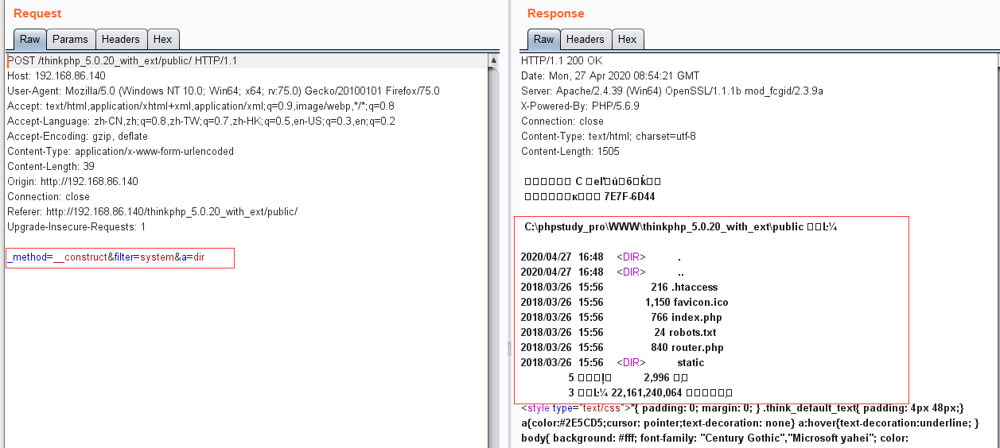
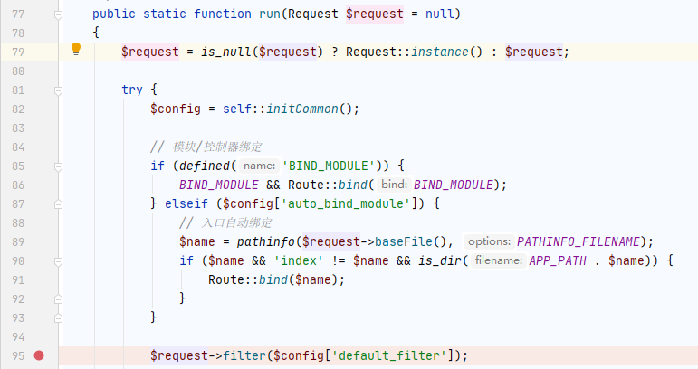
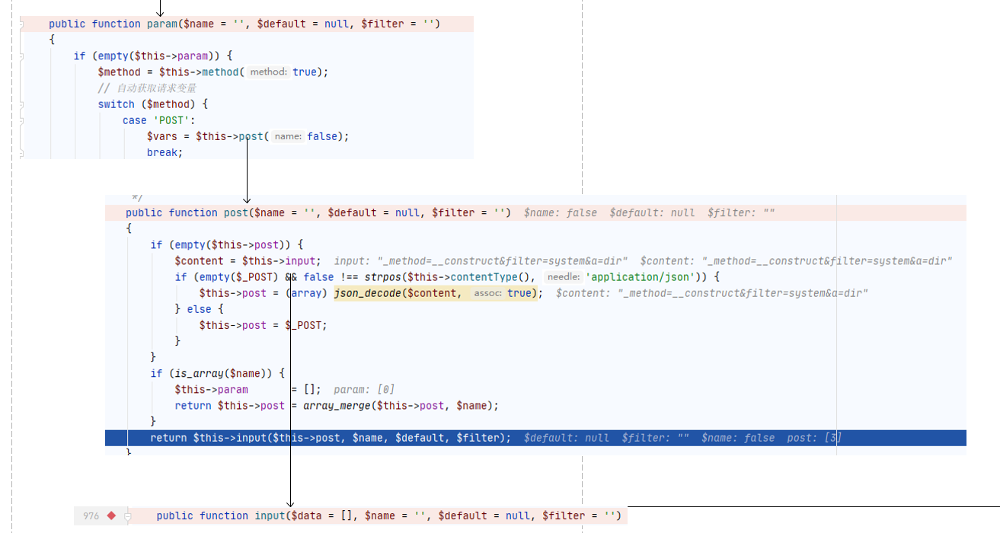

### 命令执行漏洞复现
#### 影响范围  
ThinkPHP 5.0.0~5.0.23
#### 漏洞描述
ThinkPHP实现了表单请求类型伪装的功能,例如下面的post表单中，存在_method变量，实际上是PUT方法。从客户端看这是一个post请求，而服务器会将请求识别为PUT请求进行处理。
```
<form method="post" action="">
    <input type="hidden" name="_method" value="PUT" >
</form>
```
在thinkphp中利用$_POST['_method']变量来传递真实的请求方法，当攻击者设置$_POST['_method']=__construct时，
Request类的method方法会将该类的变量进行覆盖。将filter变量覆盖为system等函数名，当内部进行参数过滤时便会进行执行任意命令。
###### 我的小思考：感觉这里有点像反序列化漏洞的利用，先覆盖“魔法函数”，然后真正执行也就是参数过滤的时候会先去执行魔法函数。利用这一点覆盖原来的变量，执行想要的就成为了关键。
#### 漏洞复现
直接跟着网上的教程复现了一遍，然后就一脸懵啦  
配置好环境之后，需要开启thinkphp的调试模式：application\config.php  ————  'app_debug'              => true,
访问主页，然后发送payload：就可以看到执行了我们想要的命令  
    

emmm!复现完了啥也不知道还是跟着看看分析吧...
#### 漏洞分析
###### 我的小思考： 1. 为什么设置为__construct就会被覆盖       2. 怎么想到覆盖filter这些变量的
首先去配置了XDebug×phpstorm，没有遇到什么大坑，就是直接照着网上的教程去配置就成功了。附上链接：https://blog.csdn.net/yinhangbbbbb/article/details/79247331      
然后就慢慢跟着走了一遍：    
首先从index.php到start.php再到APP.php,终于来到正题  
直接了当的来到public static function run(Request $request = null)这个函数，代码的注释解释这个函数是执行应用程序，我个人的理解感觉是后面执行各种模块的前提，解析了request，对路由信息进行了检测等。从这个函数逐渐深入最终找到了我们能利用的漏洞。   
      
在这个函数一开始第79行这里利用request::instance对request进行初始化，而在instance()中又会调用__construct()构造函数去构造一些信息，可以看到这里有对filter未赋值的情况下为default_filter，而通过put://input,获得我们输入的post信息。        
   
当然这里还未对filter进行任何的赋值覆盖过程，当然就算有可以看到接下来马上在95行对filter进行了初始化为defaul_filter这个值被设置在config.php中为''。    
继续往下走，看到112行这里是进行路由检测，        
    
而在这里进行路由检测的时候会调用request::method方法，method会通过post获取我们设定的值__construct，并会去执行__construct函数，也是在这里最终使得filter为system。
         
接下来就是触发漏洞关键的一点，我们需要进入request::parma，也就是通过debug模式下记录信息去触发request::parma  
          
如果我们没有开启debug模式可以看到在后面的module()函数也就是执行模块中，又一次对filter进行了初始化操作。所以必须要进入debug模式，也就是在复现漏洞时将application\config.php  ————  'app_debug'设为true的原因。   
好了，继续分析，进入request::parma，通过分析可以大致了解这里是对$method进行大致的分类，当为POST模式时，会通过post()函数获取vars的值，接着进入post函数，里面有调用了input函数。    
     
看看注释对input()的理解——“获取变量，支持过滤和默认值”，这里思路就很清楚了，那么直接去看支持过滤的函数        
   
他这里调用了getFilter(),再次跟进去看看，这里就是解析过滤器，filter设为system  
    
回到input函数内，接下来用了一个函数来对参数进行过滤，当然这里的过滤已经被替换为了system。  
    
这个函数的大意是说将$data数组内容一一对应传入到filterValue函数中去执行，其中$filter作为函数执行的参数。$data数组，也就是我们post传递的内容，总共三组，直接看到最后一组a=dir，这一组也就是我们能真正命令执行的那一组       
  
call_user_func：将filter作为回调函数执行，value是他的参数，在最后数组执行system-dir也就执行了任意命令，实现漏洞。

#### 思考
其实跟着分析下来，实现了网页对整个实现漏洞的顺序过程，不过感觉自己的思路其实是反过来的。大概应该是先发现了call_user_func()这个函数，然后发现将$filter作为了回调函数执行。然后思考能否利用这一点去执行自己的命令。这也解释了我一开始的问题，为什么是filter这个值要去找怎么赋值覆盖，然后也找到了因为__construct()函数对filter的赋值，所以要去思考怎么再次执行这个构造函数。最终构造除了最后的payload。
然后一开始跟着别人的分析走的时候特别懵，后面自己慢慢跟着理，理了个大概的流程图出来：https://github.com/rgwnyaq/Duplicate-vulnerability/blob/master/thinkphp5.0.20.pdf

##### 参考文章
https://www.freebuf.com/vuls/194127.html
