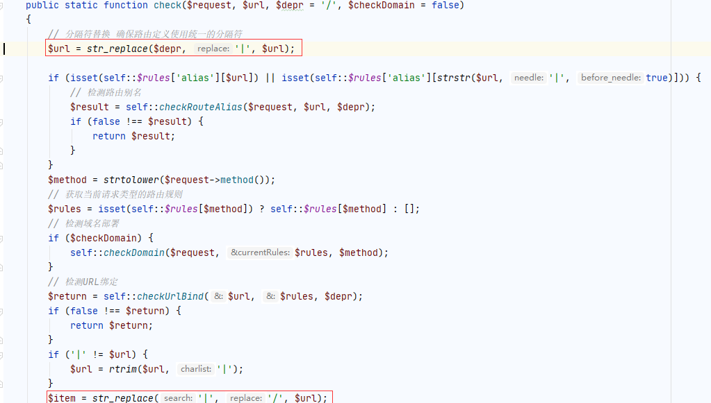
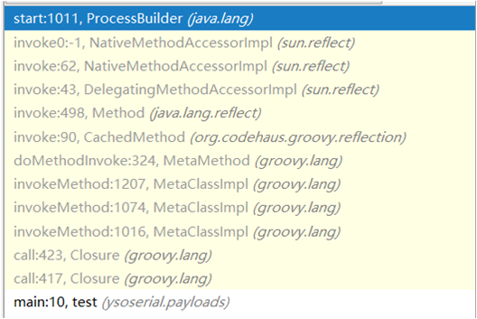

### thinkphp远程代码执行漏洞分析
#### 影响范围
5.x < 5.1.31, <= 5.0.23
#### 漏洞描述
框架对控制器没有进行足够的检测会导致在没有强制路由的情况下可能的getshell漏洞。
##### PATHINFO模式
thinkphp在常规URL解析前，先检测路由，如果发现有路由规则匹配当前的PATHINFO，那么URL解析则交给路由处理。在thinkphp5中，根据pathinfo提取到模块名，控制器名，操作方法名，将剩余的部分转换为$_GET。      
因为var_pathinfo的默认配置为s，所以我们可以利用$_GET['s']来传递路由信息     
拿POC来举例说明：
s=index/think\app/invokefunction&function=call_user_func_array&vars[0]=system&vars[1][]=whoami    
其中index为模块名，think/app为控制器名，invokefunction为操作方法名，剩下的部分转为$_GET,可以看做是方法的参数，只要构造得当还可以上传文件getshell。  
这个payload里的参数如下：
- function=call_user_func_array
- vars[0]=system
- vars[1][]=whoami
#### 漏洞复现
通过构造url，未对‘\’进行考虑检测，容易执行任意命令以及getshell。
poc：/thinkphp_5.0.22_with_extend/public/index.php?s=index/think\app/invokefunction&function=call_user_func_array&vars[0]=system&vars[1][]=whoami  

#### 漏洞分析
之前还分析了thinkphp的命令执行的漏洞，主要是基于debug模式下对filter变量覆盖的漏洞。当时其实对APP.php的代码跟着调试了一遍，但是主要漏洞点在request.php里倒是没有太过仔细跟着他去url路由检测，这一次倒是要跟进去仔细看看了。   
直接看到run()的对url进行检测的地方：    
```
    // 未设置调度信息则进行 URL 路由检测
    if (empty($dispatch)) {
        $dispatch = self::routeCheck($request, $config);
    }
```
进入routecheckrou()看看，前面的代码大都是获取pathinfo的值，开启路由，路由配置等功能，然后真正的检测大概是这里  
```
$result = Route::check($request, $path, $depr, $config['url_domain_deploy']);
```
那么进入route::check看看    
    
大概看的出来这里对路由信息做了检测部署及规范，将'/'变为'|'，之后在统一规范'|'为'/'，但这里并未对'\'，进行检测过滤。
回到routecheckrou()
```
 // 路由无效 解析模块/控制器/操作/参数... 支持控制器自动搜索
    if (false === $result) {
         $result = Route::parseUrl($path, $depr, $config['controller_auto_search']);
    }
```
检测出路由无效，所以会用Route::parseUrl去解析模块的url地址，就是这个函数将字符串解析为了模块/控制器/操作方法-参数，然后后面的执行就会按照这里解析去执行。大概看了一下这个函数，然后这里直接给出函数声明：
```
public static function parseUrl($url, $depr = '/', $autoSearch = false)
```
看的出来他直接根据'/'解析，也就是将think\app解析为了控制器。这里相当于给攻击者更大的利用空间去寻找自己可以利用的函数，特别是这些函数未做任何的约束，可操作空间极大。  
可以看到官方给出的补丁，对控制器名进行的安全过滤：  
当url解析完了之后，就要开始根据解析执行相关模块了，从routecheck()回到run()
```
 $data = self::exec($dispatch, $config);
```

$dispatch就是经过了检测解析之后的路由信息，带着未能解析正确的控制器名，exec()很明显是执行的意思，不直接执行也能看出这里带着pathinfo执行最后返回了某个信息。应该是个关键的函数点，跟进去看看。    
exec()(注释说是执行调用分发的作用):
```
    case 'module': // 模块/控制器/操作
            $data = self::module(
                $dispatch['module'],
                $config,
                isset($dispatch['convert']) ? $dispatch['convert'] : null
            );
```
type=module，跟着进来是要我们进入模块具体执行了，继续跟去module里面看看，挺长的代码，不过总结一下就是实例化模块，获取模块，获取模块的控制器名，操作方法名，最后执行操作方法名。也就是这里真正执行了我们传入的invokefunction方法。大致整理了一个从exec()到module()在到invokefunction()的大致流程。  
     
最终完成了漏洞了整个流程的利用。
#### 思考
复现这个漏洞的难点其实不在漏洞的触发上，更多考验的是否对thinkphp的pathinfo模式的了解。网上很多的分析就是直接说框架的控制器没有足够的检测。然后开始看的时候完全不知道是啥，后来慢慢了解到是他的一个URL解析的模式，这种模式能够更安全的保护网站信息，不会通过url透露太多信息。分析到后面的时候exec()函数执行的时候就更多的是在讲thinkphp怎么调用这种模式去进行解析执行了。真正的漏洞点还是在对那一串phpinfo的过滤上没能好好检测。
